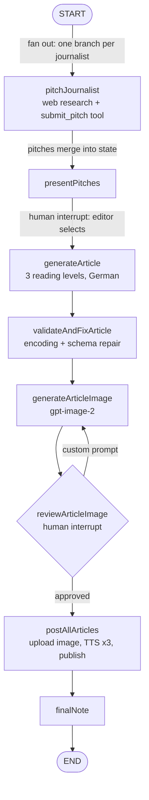

# News Desk

A LangGraph multi-agent newsroom that researches the day's real stories, writes them
as graded German reading material, illustrates them, narrates them, and publishes them
to a CMS. Five journalist personas pitch, a human editor picks, and the pipeline carries
the selected stories to production.

This is the editorial backend of [Library Universe](https://libraryuniverse.com), a news
platform for German learners. It runs in production.

## Why it is interesting

Most agent demos stop at "an LLM returns text." The hard part of a real pipeline is
everything after that: keeping parallel branches from clobbering shared state, getting a
human into the loop without losing the run, and turning model output into a payload a
CMS will actually accept.

- **Fan-out and fan-in.** Five journalists research in parallel from `START`, each in its
  own graph branch, and their pitches merge back into one state object through reducers.
- **Two human checkpoints.** LangGraph `interrupt()` pauses mid-run so an editor selects
  pitches and approves illustrations. Rejecting an image loops that one article back for
  regeneration while the others hold their place.
- **A validator agent that repairs its colleagues' output.** German text comes back from
  the model with ASCII substitutions (`oe` for `ö`, `ss` for `ß`). A dedicated agent fixes
  encoding using language context, leaving foreign names alone, and repairs schema
  violations rather than failing the run.
- **Tool-captured structured output.** Pitches and validated articles are captured through
  Zod-typed tools (`submit_pitch`, `submit_validated_article`), not parsed out of prose.
- **Nothing touches disk.** Images arrive as base64, audio is generated into buffers, and
  both stream straight to the CMS as assets.

## Architecture



Four phases, eight nodes, two interrupt points, two fan-out points. The full node-by-node
walkthrough, state table, and reducer semantics are in
[docs/architecture.md](docs/architecture.md); the stack rationale is in
[docs/tech-stack.md](docs/tech-stack.md).

## The journalists

Each persona is a prompt-defined identity with its own beat, editorial temperament, and
literary influences, plus a stable byline in the CMS.

| Journalist | Beat | Political |
| --- | --- | --- |
| George Bourdieu | Politics and economics, left | yes |
| William F. Brooks | Politics and economics, right | yes |
| Hannah Benjamin | Culture, society, history | no |
| Carl Frankl | Health | no |
| Isaac Sagan | Science and technology | no |

The two political personas are deliberately paired so the same day's news is covered from
both framings, and each is required to state the opposing view. Political articles carry
`leaning`, `agencyLevel`, `humanConcern`, and `opposingView` fields; non-political ones are
required not to.

Personas live in [`src/personas.ts`](src/personas.ts). Adding a sixth journalist is four
edits and no graph changes, since the pitch fan-out maps over `ALL_JOURNALIST_IDS`.

## What an article has to contain

Every story is generated at three CEFR levels (A2, B1-B2, C1) from one pitch. Each level
needs at least 8 Portable Text blocks, 4 comprehension questions, and 6 vocabulary items
with 4 options each and a German rationale. Then it gets an illustration and three MP3
narrations, one per level.

That is roughly 40 schema constraints an LLM has to satisfy at once, which is why the
validation pass exists.

## Stack

TypeScript 5.8 with ES modules, Node 20, LangGraph JS 1.3.6, LangChain 1.4, Zod for tool
schemas, OpenAI for chat / hosted web search / images / text-to-speech, Sanity Content Lake
as the CMS. `MemorySaver` is the checkpointer, which suits local and single-operator runs.

## Run it

```bash
npm install
cp .env.example .env   # add OPENAI_API_KEY and SANITY_API_TOKEN
npm run dev            # LangGraph Studio, graph is registered as news_desk
```

The graph is interrupt-driven, so Studio is the intended way to drive it: you will be
prompted to select pitches and to approve each illustration.

Publishing targets a Sanity dataset with an `article` schema and `author` documents. The
expected payload shape is in [`src/schema.ts`](src/schema.ts). Point it at your own
project via `SANITY_PROJECT_ID` and update the `luAuthors` references in the persona
prompts to your own author document IDs.

## Also here

[`skills/`](skills/) holds the same newsroom as Agent Skills for Claude Code and other
compatible agents: one skill per journalist, plus an editor and a generator skill. The
graph is the automated path; the skills are the conversational one.

## Notes and limits

- Source quality depends on the model and its web search results. The prompts require
  three reputable sources and name preferred outlets, but this is not a verification system.
- Publishing is coupled to generation: once articles are selected and generated,
  `postAllArticles()` narrates and publishes them.
- Anthropic call sites exist as commented alternatives; the active path is OpenAI.

## License

MIT
